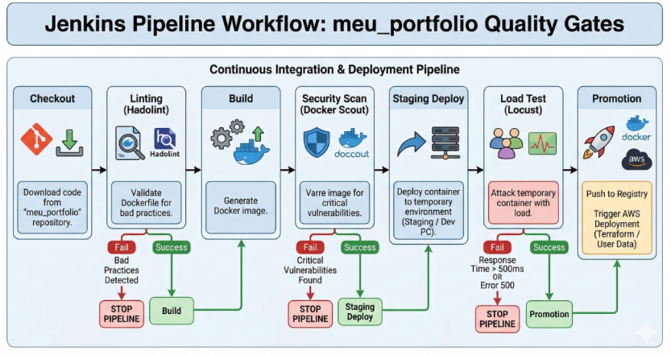

# ⚙️ HMS Cloud - Continuous Integration & Deployment (CI/CD)

Este repositório contém a inteligência de automação e os **Portões de Qualidade (Quality Gates)** do projeto HMS Cloud. O objetivo é garantir que nenhuma linha de código ou imagem de container chegue à produção (AWS) sem passar por um rigoroso processo de validação, segurança e testes de carga.

O orquestrador escolhido para este fluxo é o **Jenkins**, operando sob o conceito de *Pipeline as Code* (Jenkinsfile).

---

## 🔄 Workflow da Pipeline (Quality Gates)

O fluxo de CI/CD foi desenhado para falhar rápido (*fail-fast*). Se uma etapa não atingir os critérios de qualidade, o deploy é imediatamente abortado.



### As 7 Etapas do Pipeline:

1. **Checkout:** O Jenkins detecta uma alteração e faz o clone do repositório da aplicação (`meu_portfolio`).
2. **Linting (Hadolint):** Análise estática do `Dockerfile` em busca de más práticas. Se houver erro de prática ruim, o pipeline para aqui.
3. **Build:** Construção da imagem Docker baseada no código mais recente.
4. **Security Scan (Docker Scout):** Varredura profunda na imagem construída. O pipeline é abortado se vulnerabilidades críticas ou altas forem encontradas.
5. **Staging Deploy:** A imagem aprovada é colocada em execução em um ambiente efêmero (temporário) dentro do servidor Ubuntu Admin.
6. **Load Test (Locust):** Ataque de estresse automatizado contra o container temporário. O pipeline falha se o tempo de resposta exceder **500ms** ou se houver erros **500 (Internal Server Error)**.
7. **Promotion (Push & Deploy):** Envio da imagem validada para o repositório oficial na AWS (Amazon ECR) e acionamento (Trigger) do deploy na infraestrutura da AWS.

---

## 🛠️ Pré-requisitos e Arquitetura do Orquestrador

O Jenkins roda de forma isolada em uma máquina administrativa (Ubuntu Admin). Para que o container do Jenkins consiga "buildar" outras imagens Docker, utilizamos a arquitetura **Docker-out-of-Docker (DooD)**, mapeando o arquivo de soquete `/var/run/docker.sock` do hospedeiro.

* Servidor Ubuntu configurado com Docker Engine.
* Credenciais da AWS (Access Key e Secret Key) com permissões para o Elastic Container Registry (ECR).
* Repositório ECR previamente criado na AWS.
* Jenkins configurado com os plugins: `Pipeline`, `Docker Pipeline`, , `AWS Credentials` e credenciais configuradas.

---

## 📂 Estrutura do Repositório

Esta é a organização dos artefatos de infraestrutura e testes de carga deste projeto:

```text
portifolio_CI_CD/
├── .gitignore              # Proteção contra vazamento de variáveis e arquivos locais
├── docker-compose.yml      # Declaração do serviço Jenkins em arquitetura DooD
├── Dockerfile.jenkins      # Imagem customizada do Jenkins com Docker CLI embutido
├── Jenkinsfile             # Pipeline Declarativo com os 7 Portões de Qualidade
├── locustfile.py           # Script Python para simulação de carga e testes de SLA
├── README.md               # Documentação principal
└── docs/
    └── pipeline.jpg        # Diagrama visual do workflow
```

---

## 💻 Estrutura de Código (Em Desenvolvimento)

### 1. Infraestrutura do Jenkins (Docker Compose)
*(Arquivo responsável por subir o Jenkins com a estratégia Docker-out-of-Docker).*

Após instalar o Jenkins, instalar os seguintes plugins:

1. Docker Pipeline
2. AWS Credentials

* Criação da imagem Jenkins

```Dockerfile
FROM jenkins/jenkins:lts

# Muda para root para conseguir instalar pacotes no Linux do container
USER root

# Instala as dependências e o Docker CLI (Client)
RUN curl -fsSL -O https://download.docker.com/linux/static/stable/x86_64/docker-25.0.3.tgz && \
    tar xzvf docker-25.0.3.tgz && \
    mv docker/docker /usr/local/bin/ && \
    rm -rf docker docker-25.0.3.tgz

# Retorna para o usuário padrão do Jenkins (ou mantém root via docker-compose, dependendo da permissão do socket)
```
---

* Docker Compose

```yaml
version: '3.8'

services:
  jenkins:
    build:
      context: .
      dockerfile: Dockerfile.jenkins
    container_name: hms-jenkins-dood
    user: root # Permissão obrigatória para ler o docker.sock do Ubuntu
    ports:
      - "8080:8080"
      - "50000:50000"
    volumes:
      - jenkins_data:/var/jenkins_home
      - /var/run/docker.sock:/var/run/docker.sock # A mágica do DooD: conectando ao motor hospedeiro
    restart: unless-stopped
    environment:
      - TZ=America/Sao_Paulo

volumes:
  jenkins_data:
    name: hms_jenkins_data
```

### 2. O Pipeline Declarativo (Jenkinsfile)
* (O código que define as etapas e os Portões de Qualidade).

```groovy
pipeline {
    agent any

    environment {
        // ====================================================================
        // 🚨 CONFIGURAÇÕES DO AWS ECR (PREENCHA ESTES DADOS POSTERIORMENTE) 🚨
        // ====================================================================
        AWS_REGION         = 'us-east-1'
        AWS_ACCOUNT_ID     = 'COLOQUE_SEU_ACCOUNT_ID_AQUI'
        ECR_REPO_NAME      = 'meu-portfolio'
        ECR_REGISTRY       = "${AWS_ACCOUNT_ID}.dkr.ecr.${AWS_REGION}.amazonaws.com"
        AWS_CREDENTIALS_ID = 'aws-credentials-id' // Criaremos essa credencial na interface do Jenkins depois
        // ====================================================================
        
        IMAGE_NAME         = 'hms-portfolio-flask'
        STAGING_PORT       = '5001' // Porta que o ambiente temporário vai usar no seu Ubuntu
    }

    stages {
        stage('1. Checkout') {
            steps {
                echo '📥 Baixando código fonte do repositório da aplicação...'
                // Aqui o Jenkins vai clonar o seu repo 'meu_portfolio'
                checkout scm
            }
        }

        stage('2. Linting (Hadolint)') {
            steps {
                echo '🔎 Inspecionando Dockerfile em busca de más práticas...'
                // Roda um container efêmero do Hadolint para validar o seu Dockerfile
                sh 'docker run --rm -i hadolint/hadolint < Dockerfile'
            }
        }

        stage('3. Build') {
            steps {
                echo '🏗️ Construindo a imagem Docker da aplicação...'
                sh "docker build -t ${IMAGE_NAME}:latest ."
            }
        }

        stage('4. Security Scan (Docker Scout)') {
            steps {
                echo '🛡️ Varrendo imagem atrás de vulnerabilidades Críticas/Altas...'
                // O --exit-code aborta o pipeline se achar falhas graves
                sh "docker run --rm -v /var/run/docker.sock:/var/run/docker.sock docker/scout-cli cves --exit-code --only-severity critical,high ${IMAGE_NAME}:latest"
            }
        }

        stage('5. Staging Deploy') {
            steps {
                echo '🚀 Subindo container temporário para testes de carga...'
                // Derruba qualquer container de staging antigo que tenha ficado travado
                sh "docker rm -f staging-portfolio || true"
                // Sobe o container validado na porta 5001
                sh "docker run -d --name staging-portfolio -p ${STAGING_PORT}:5000 ${IMAGE_NAME}:latest"
                // Aguarda 5 segundos para o Gunicorn/Flask iniciar
                sleep 5 
            }
        }

        stage('6. Load Test (Locust)') {
            steps {
                echo '🔥 Iniciando ataque de estresse no container Staging...'
                // Roda o Locust usando um container efêmero na mesma rede do hospedeiro
                sh """
                docker run --rm \
                  --network host \
                  -v \${PWD}:/mnt -w /mnt \
                  locustio/locust -f locustfile.py \
                  --headless \
                  -u 50 -r 10 \
                  --run-time 30s \
                  --host http://localhost:${STAGING_PORT} \
                  --exit-code-on-error 1
                """
            }
        }

        stage('7. Promotion (Push para AWS ECR)') {
            steps {
                echo '📦 Testes aprovados! Promovendo imagem para a AWS...'
                script {
                    // Este bloco fará o login na AWS, "tageará" a imagem e fará o Push.
                    // ATENÇÃO: Ele falhará até preenchermos as variáveis do ECR no topo.
                    /*
                    withCredentials([[
                        $class: 'AmazonWebServicesCredentialsBinding', 
                        credentialsId: "${AWS_CREDENTIALS_ID}", 
                        accessKeyVariable: 'AWS_ACCESS_KEY_ID', 
                        secretKeyVariable: 'AWS_SECRET_ACCESS_KEY'
                    ]]) {
                        sh "aws ecr get-login-password --region ${AWS_REGION} | docker login --username AWS --password-stdin ${ECR_REGISTRY}"
                        sh "docker tag ${IMAGE_NAME}:latest ${ECR_REGISTRY}/${ECR_REPO_NAME}:latest"
                        sh "docker push ${ECR_REGISTRY}/${ECR_REPO_NAME}:latest"
                    }
                    */
                    echo "⚠️ (Simulado) Push para o ECR ignorado até a configuração das credenciais."
                }
            }
        }
    }

    post {
        always {
            echo '🧹 Limpando o ambiente de Staging...'
            sh "docker rm -f staging-portfolio || true"
        }
        success {
            echo '✅ Pipeline concluído com sucesso! Imagem pronta para Produção.'
        }
        failure {
            echo '❌ Pipeline falhou. Verifique os logs da etapa que quebrou.'
        }
    }
}
```

### 3. Cenários de Teste de Carga (Locust)
* (Script em Python para simular usuários simultâneos no ambiente de Staging).
* locustfile.py

```python
from locust import HttpUser, task, between

class PortfolioUser(HttpUser):
    # Simula o tempo de espera "humano" entre cliques (1 a 3 segundos)
    wait_time = between(1, 3)

    @task(3)
    def load_home(self):
        with self.client.get("/", catch_response=True) as response:
            if response.status_code == 500:
                response.failure("Erro 500: Internal Server Error na Home!")
            elif response.elapsed.total_seconds() > 0.5:
                response.failure(f"SLA Violado na Home: {response.elapsed.total_seconds():.3f}s")
            else:
                response.success()

    @task(1)
    def download_cv(self):
        # Rota exata do currículo no seu Flask
        with self.client.get("/static/docs/curriculo.pdf", catch_response=True) as response:
            if response.status_code != 200:
                response.failure(f"Falha ao baixar CV! Código retornado: {response.status_code}")
            else:
                response.success()
```

## 🚀 Como Usar (Subindo o Orquestrador)

Siga os passos abaixo no seu servidor Ubuntu Admin para iniciar a infraestrutura do Jenkins:

1. **Clone o repositório:**
   ```bash
   git clone [https://github.com/henrique-mozart-de-souza/portifolio_CI_CD.git](https://github.com/henrique-mozart-de-souza/portifolio_CI_CD.git)
   cd portifolio_CI_CD
   ```

2. **Inicie o Jenkins (com build da imagem DooD):**

```bash
docker-compose up -d --build
```

3. **Recupere a senha inicial de Administrador:**
* O Jenkins gera uma senha de segurança no primeiro boot. Pegue-a rodando o comando abaixo:

```bash
docker exec hms-jenkins-dood cat /var/jenkins_home/secrets/initialAdminPassword
```

4. **Acesse a Interface Web:**

* Abra o navegador e acesse http://<IP_DO_SEU_UBUNTU>:8080. Cole a senha recuperada no passo anterior para iniciar a instalação dos plugins sugeridos.


* Desenvolvido com automação extrema por Henrique Mozart de Souza.